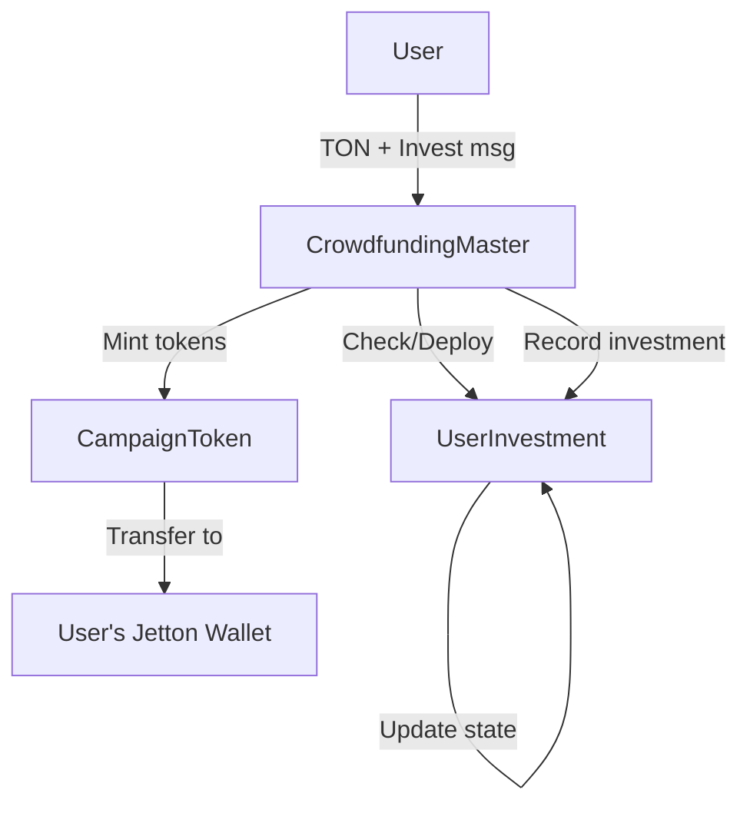
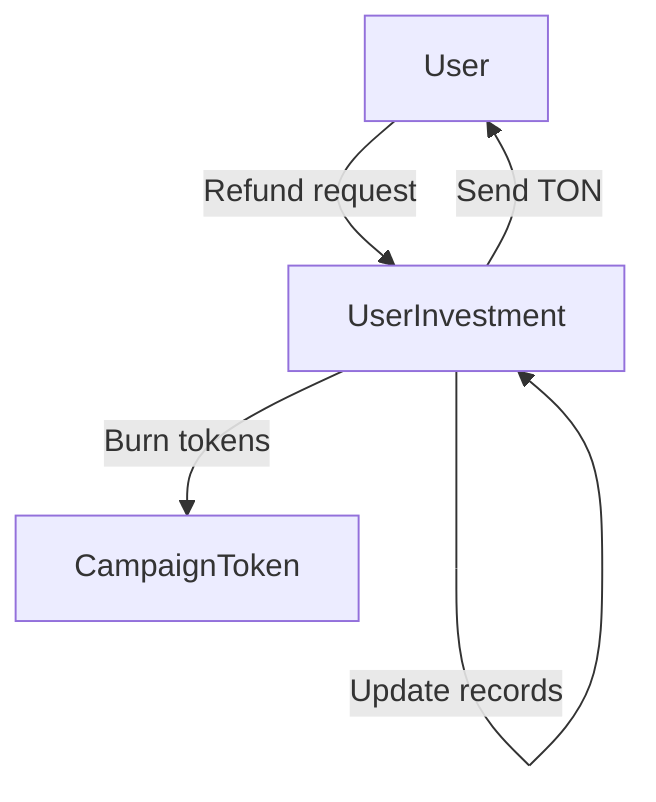
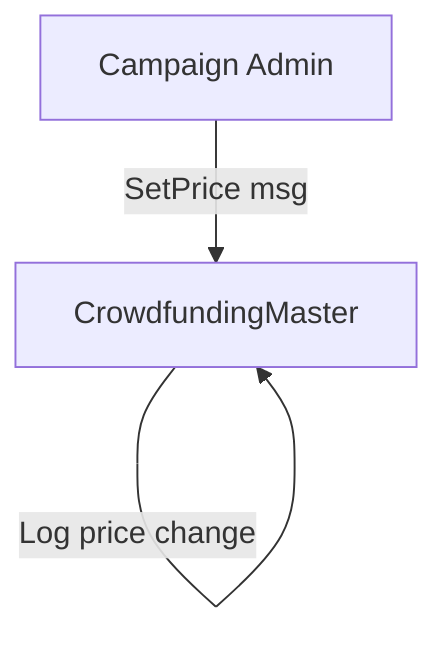

# SYSTEM PATTERNS: TON Crowdfunding Smart Contract Architecture

## ARCHITECTURAL PATTERN SELECTION

### Primary Pattern: Adapted Factory + Master-Child
Based on analysis of Simple-Dex pump.fun-like DEX architecture, we adapt the proven three-contract system:

**Original Simple-Dex Pattern**:
```
TonkPumpFactory → TonkPumpJetton + TonkPumpAMM
(Deploys paired contracts for each token)
```

**Adapted Crowdfunding Pattern**:
```
CrowdfundingFactory → CrowdfundingMaster + CampaignToken
                  ↓
              UserInvestment contracts (individual)
```

### Factory Contract (CrowdfundingFactory)
**Purpose**: Deploy and manage crowdfunding campaigns
**Inspired by**: TonkPumpFactory deployment pattern
**Key Features**:
- Deploy paired Master+Token contracts for each campaign
- Track all deployed campaigns with efficient storage
- Admin controls for campaign approval/management
- Emergency stop/resume functionality
- Deployment fee management

```tact
struct DeployedCampaign {
    masterAddress: Address;
    tokenAddress: Address;
    creator: Address;
    isActive: Bool;
}

contract CrowdfundingFactory with Deployable, Ownable, Stoppable {
    deployedCampaigns: map<Int, DeployedCampaign>;
    campaignCounter: Int;
    deploymentFee: Int as coins;
    
    receive(msg: CreateCampaign) {
        // Deploy Master + Token contracts
        // Store campaign info
        // Return excess funds
    }
}
```

### Master Contract (CrowdfundingMaster)  
**Purpose**: Campaign logic and price management
**Inspired by**: TonkPumpAMM trading logic adaptation
**Key Features**:
- Manual price setting by admin (not bonding curve)
- Investment processing and jetton minting
- Refund processing at original prices
- User contract factory functionality
- Historical price tracking for refunds

```tact
contract CrowdfundingMaster with Deployable {
    // Campaign settings
    campaignToken: Address;
    admin: Address;
    currentPrice: Int as coins; // Manual price setting
    
    // Investment tracking
    totalInvested: Int as coins;
    totalTokensIssued: Int as coins;
    
    // User contracts mapping
    userContracts: map<Address, Address>;
    
    receive(msg: Invest) {
        // Calculate tokens based on current price
        // Deploy user contract if needed
        // Process investment
        // Mint tokens
    }
    
    receive(msg: SetPrice) {
        // Admin-only price updates
        require(sender() == self.admin, "Not authorized");
        self.currentPrice = msg.newPrice;
    }
}
```

### User Contract (UserInvestment)
**Purpose**: Individual investment and refund tracking
**Inspired by**: TonkPumpDefaultWallet individual state management
**Key Features**:
- Track all user investments with prices
- Calculate refund amounts at original prices
- Process refund requests
- Secure individual state management

```tact
struct InvestmentRecord {
    amount: Int as coins;      // TON invested
    tokensReceived: Int as coins; // Jettons received
    priceAtPurchase: Int as coins; // Price per token
    timestamp: Int as uint32;   // Investment time
}

contract UserInvestment with Deployable {
    masterContract: Address;
    tokenContract: Address;
    investor: Address;
    
    investments: map<Int, InvestmentRecord>;
    investmentCounter: Int;
    totalInvested: Int as coins;
    totalTokens: Int as coins;
    
    receive(msg: RecordInvestment) {
        // Record new investment
        // Update totals
    }
    
    receive(msg: ProcessRefund) {
        // Calculate refund at original prices
        // Burn tokens
        // Send TON refund
    }
}
```

### Campaign Token (CampaignToken)
**Purpose**: Standard jetton implementation for campaign rewards
**Inspired by**: TonkPumpJetton TEP-74 implementation
**Key Features**:
- Full TEP-74 jetton standard compliance
- Mintable by Master contract only
- Burnable for refunds
- Standard wallet functionality

## SIMPLE-DEX ANALYSIS & ADAPTATION

### Key Insights from Simple-Dex Code

#### 1. Factory Pattern Implementation
**Simple-Dex Approach**:
```tact
struct DeployedPair {
    jettonAddress: Address;
    ammAddress: Address;
}

deployedPairs: map<Int, DeployedPair>;
```

**Crowdfunding Adaptation**:
```tact
struct DeployedCampaign {
    masterAddress: Address;
    tokenAddress: Address;
    creator: Address;
    isActive: Bool;
}

deployedCampaigns: map<Int, DeployedCampaign>;
```

#### 2. Price Mechanics
**Simple-Dex**: Bonding curve `p(s) = b + (s * i) / 10^9`
**Crowdfunding**: Manual admin pricing with historical tracking

#### 3. Token Lifecycle
**Simple-Dex**: Mint → Trade → Burn (AMM)
**Crowdfunding**: Invest → Hold → Refund (Original price)

#### 4. Admin Controls
**Simple-Dex**: DevMint for allocations, fee management
**Crowdfunding**: Price setting, campaign management, emergency controls

#### 5. Gas Optimization Patterns
**From Simple-Dex**:
- Efficient struct storage
- Proper value handling in deployment
- Emergency stop/resume functionality
- Minimal TON storage requirements

## CONTRACT INTERACTION FLOW

### Investment Flow


### Refund Flow  


### Admin Price Update Flow


## MESSAGE INTERFACE DESIGN

### Investment Messages
```tact
message Invest {
    amount: Int as coins; // TON amount to invest
}

message RecordInvestment {
    investor: Address;
    amount: Int as coins;
    tokensReceived: Int as coins;
    priceAtPurchase: Int as coins;
}
```

### Refund Messages
```tact
message RequestRefund {
    tokenAmount: Int as coins; // Tokens to refund
}

message ProcessRefund {
    tokenAmount: Int as coins;
    refundAmount: Int as coins;
}
```

### Admin Messages
```tact
message SetPrice {
    newPrice: Int as coins; // New token price
}

message CreateCampaign {
    campaignName: String;
    tokenSymbol: String;
    initialPrice: Int as coins;
    tokenMetadata: Cell;
}
```

## SECURITY PATTERNS

### Access Control
- Factory: Owner-only campaign approval
- Master: Admin-only price setting  
- User: Investor-only refund requests
- Token: Master-only minting

### State Validation
- Investment amount > 0
- Sufficient balances for refunds
- Valid price updates (> 0)
- Proper contract relationships

### Emergency Controls
- Factory emergency stop (from Simple-Dex)
- Master contract pause functionality
- User contract individual controls

## GAS OPTIMIZATION STRATEGIES

### From Simple-Dex Analysis
1. **Efficient Storage**: Use structs for related data
2. **Batch Operations**: Deploy multiple contracts efficiently
3. **Value Handling**: Proper TON value distribution
4. **Minimal Storage**: Keep only essential data on-chain

### Crowdfunding-Specific Optimizations
1. **Investment Batching**: Group small investments
2. **Price Caching**: Cache frequently accessed prices
3. **Refund Optimization**: Efficient refund calculations
4. **State Compression**: Minimize user contract storage

## DATA PERSISTENCE PATTERNS

### Historical Price Tracking
```tact
struct PriceHistory {
    price: Int as coins;
    timestamp: Int as uint32;
    setBy: Address;
}

priceHistory: map<Int, PriceHistory>;
```

### Investment Records
```tact
struct InvestmentRecord {
    amount: Int as coins;
    tokensReceived: Int as coins; 
    priceAtPurchase: Int as coins;
    timestamp: Int as uint32;
}

investments: map<Int, InvestmentRecord>;
```

### Campaign State
```tact
struct CampaignState {
    isActive: Bool;
    totalInvested: Int as coins;
    totalTokensIssued: Int as coins;
    currentPrice: Int as coins;
    admin: Address;
}
```

## INTEGRATION WITH EXISTING PATTERNS

### TEP-74 Jetton Standard
- Full compliance with TON jetton standard
- Custom wallet implementation for campaign tokens  
- Standard transfer/burn functionality
- Metadata support for campaign information

### Factory Pattern Enhancement
- Efficient campaign tracking
- Admin approval workflow
- Emergency controls integration
- Fee management system

### Scalability Through User Contracts
- Individual state management
- Reduced master contract complexity
- Parallel processing capability
- User-specific gas optimization

## IMPLEMENTATION PRIORITIES

### Phase 1: Core Contracts
1. CrowdfundingFactory (deployment)
2. CrowdfundingMaster (basic logic)
3. CampaignToken (jetton standard)

### Phase 2: User Management  
1. UserInvestment contract
2. Investment recording
3. Basic refund functionality

### Phase 3: Advanced Features
1. Historical price tracking
2. Admin dashboard functionality
3. Emergency controls
4. Gas optimizations

### Phase 4: Integration & Testing
1. End-to-end testing
2. Security audit preparation
3. Deployment scripts
4. Documentation completion 